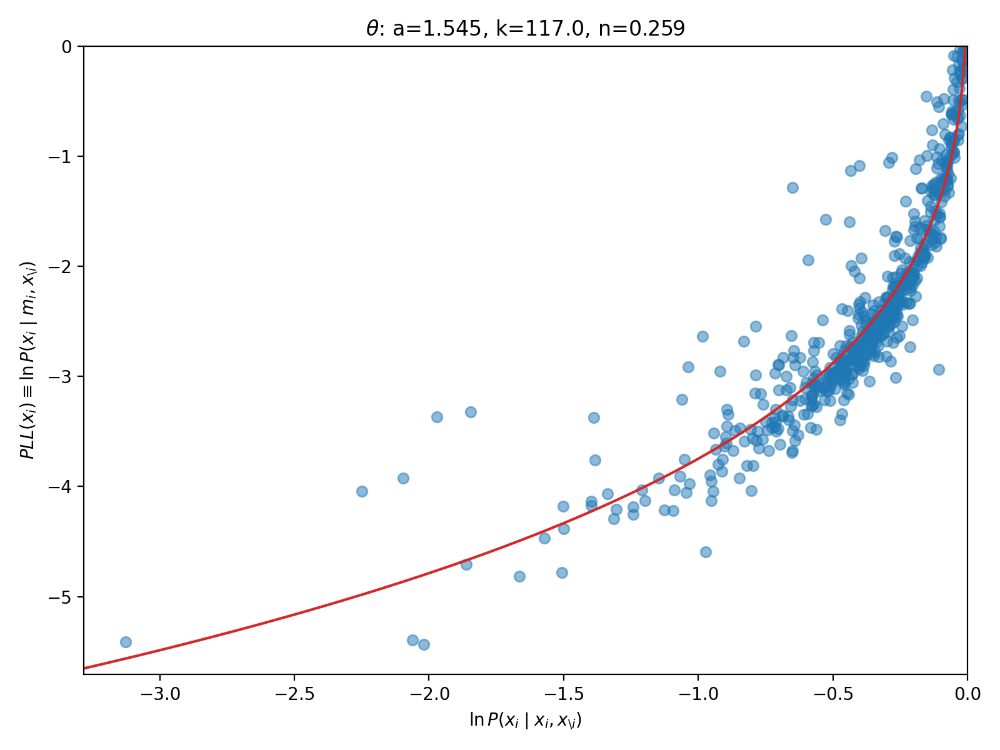
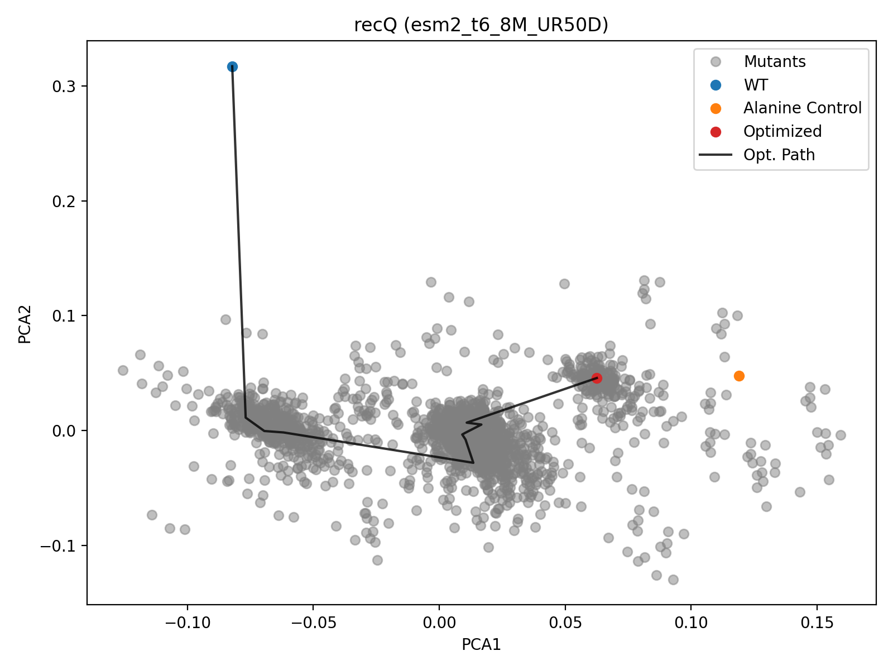
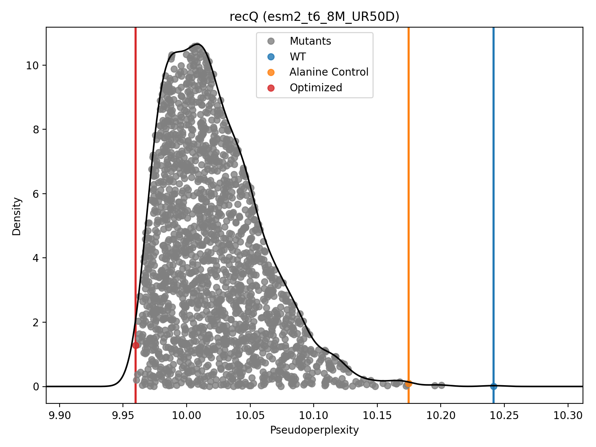

# RemoveCysteines
Remove cysteines from a protein sequences using evolutionary scale modeling (ESM) to account for conservation.

## Run on Google Colab 
<a href="https://colab.research.google.com/github/ckinzthompson/removecysteines/blob/main/docs/removecysteines_notbook.ipynb" target="_parent"></a>

Make sure you select a (free) GPU instance, because it will be very slow on a CPU.


## Run local
Use a computer with a CUDA GPU, macbook GPU, or just a CPU.

Install from a terminal using
```sh
pip install git+https://github.com/ckinzthompson/removecysteines.git
```

After installing you can run with 
```sh
removecysteines <seq>
```

Alternatively, from the top-level directory `removecysteines`, you can run
```sh
python -m removecysteines <seq>
```


## Examples

### Mapping WT conditionals probabilities to PLL values
<!--  -->


### PCA of the region of ESM2 latent space around the variants
<!--  -->


### Distribution of Pseudoperplexities
*Note: Lower is better*
<!--  -->


## Help 
To see the help message, add `--help` to the command

```sh
$ removecysteines --help
```

The following message will be displayed:

```sh
usage: removecysteines [-h]
  [--model {esm2_t6_8M_UR50D,esm2_t12_35M_UR50D,esm2_t30_150M_UR50D,esm2_t33_650M_UR50D,esm2_t36_3B_UR50D,esm2_t48_15B_UR50D}]
  [--device {mps,cpu}] [--model_directory MODEL_DIRECTORY] [--n_rounds N_ROUNDS] [--output_prefix OUTPUT_PREFIX]
  [--no_plots]
  sequence

---------------------------------------------
  Remove Cysteines (v0.2.0)
  CKT Lab -- http://ckinzthompson.github.io
---------------------------------------------

positional arguments:
  sequence              WT protein sequence to alter

optional arguments:
  -h, --help            show this help message and exit
  --model {esm2_t6_8M_UR50D,esm2_t12_35M_UR50D,esm2_t30_150M_UR50D,esm2_t33_650M_UR50D,esm2_t36_3B_UR50D,esm2_t48_15B_UR50D}
                        Which ESM2 model to use?
  --device {mps,cpu}    Which compute device?
  --model_directory MODEL_DIRECTORY
                        Where to save/load the ESM model files
  --n_rounds N_ROUNDS   Maximum Number of Polishing Rounds
  --output_prefix OUTPUT_PREFIX
                        Choose a prefix to save the images
  --no_plots            Do not display any plots
```
