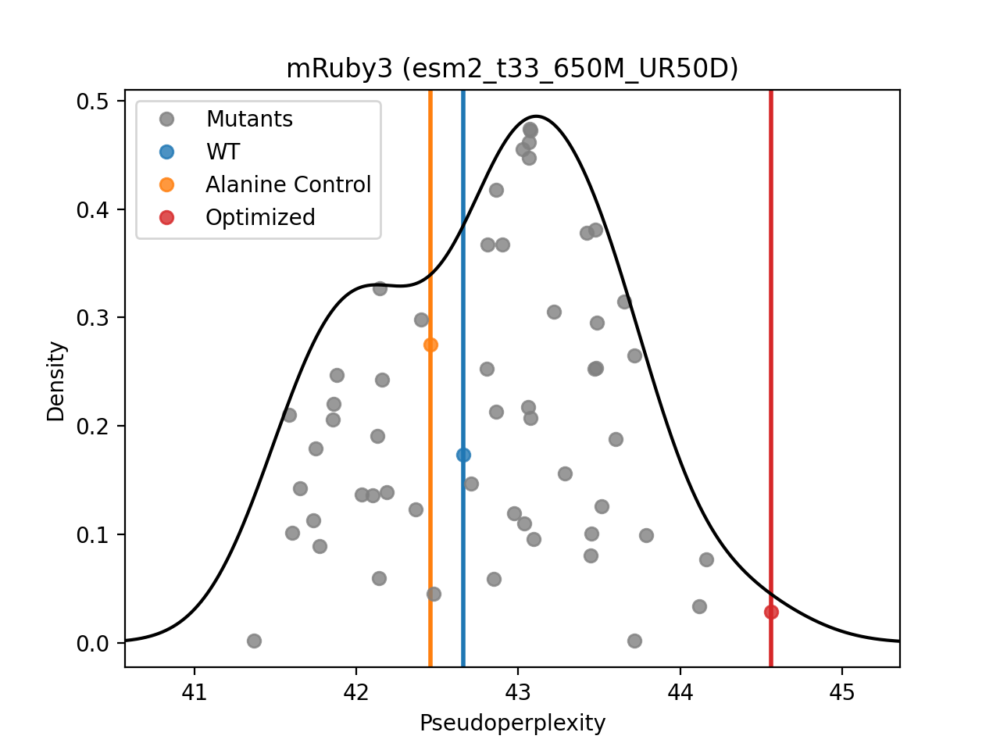

# RemoveCysteines
Remove cysteines from a protein sequences using evolutionary scale modeling (ESM) to account for conservation.

## Run on Google Colab 
<a href="https://colab.research.google.com/github/ckinzthompson/removecysteines/blob/main/remove_cysteines.ipynb" target="_parent"></a>

Make sure you select a (free) GPU instance, because it will be very slow on a CPU.


## Run locally (Python)
Requires either:
1. A new Apple Silicon computer
2. A computer with a CUDA-capable GPU

Steps:
* Download `remove_cysteine.py`
* Install torch, fair-esm, numpy, and matplotlib
* Run from the terminal:

```bash
> python remove_cysteines.py --help
usage: remove_cysteines.py [-h] [--n_rounds N_ROUNDS] [--model {esm2_t6_8M_UR50D,esm2_t12_35M_UR50D,esm2_t30_150M_UR50D,esm2_t33_650M_UR50D,esm2_t36_3B_UR50D,esm2_t48_15B_UR50D}] [--device {mps,cpu}] [--pca] [--pp] [--output_prefix OUTPUT_PREFIX] sequence

Remove Cysteines (v0.1.5). CKT Lab -- http://ckinzthompson.github.io

positional arguments:
  sequence              WT protein sequence to alter

optional arguments:
  -h, --help            show this help message and exit
  --n_rounds N_ROUNDS   Maximum Number of Polishing Rounds
  --model {esm2_t6_8M_UR50D,esm2_t12_35M_UR50D,esm2_t30_150M_UR50D,esm2_t33_650M_UR50D,esm2_t36_3B_UR50D,esm2_t48_15B_UR50D}
                        Which ESM2 model to use?
  --device {mps,cpu}    Which compute device?
  --pca                 Show embedding PCA?
  --pp                  Show pseudoperlexities?
  --output_prefix OUTPUT_PREFIX
                        Choose a prefix to save the images
```

## Examples
#### PCA of the ESM latent space

#### Distribution of pseudoperplexities

